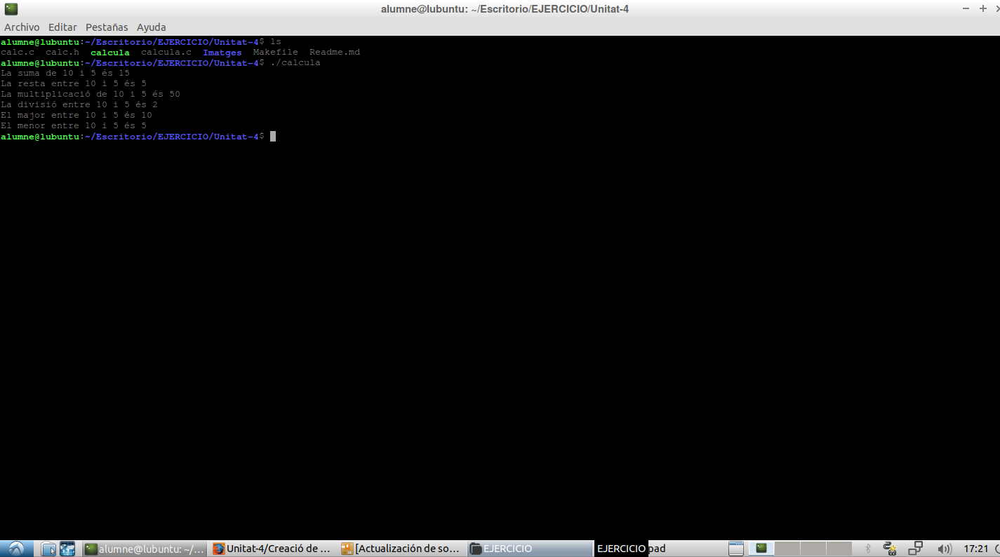

git clone https://github.com/USUARIGITHUB/REPOSITORI.git

>***`En el meu cas:`***  

git clone https://github.com/Maxim1erDAM/Unitat-4.git

>***`Després de descarregar-lo, ens situarem en el directori i sincronitzarem el directori amb el repositori de Github.`***  
"git remote add origin https://github.com/USUARIGITHUB/REPOSITORI.git" :`***  

>***`Eixemple:`***  

cd Unitat-4/

git remote add origin https://github.com/Maxim1erDAM/Unitat-4.git

## 3.-Make i el fitxer Makefile
>***`Modificarem els fitxers, en este cas son els fitxers escrits en C del exercici "Calcula":calc.c, calc.h i calcula.c amb companyia del fitxer Makefile de make.`***  

>***`Executem tots els TARGETS del makefile amb "sudo make TARGET", tambe utilitzem "sudo make dist" per a crear un directori "dist" amb el compilat de calcula al directori fill, i "sudo make distclean" per a eliminar eixe directori: `***  

>***`Com s'elimina el directori "dist" amb el target "distclean": `***  

>***`Executem el archiu "calcula" compilat del makefile amb "sudo make calc.o" i "sudo make calcula": `*** 

## 4.-Com utilitzar Git Part 2.
>***`Al modificar els fitxers tindrem que sincronizarlos amb el nostre repositori local de GIT amb "git add" : `***  

git add NOMDEFITXER

>***`Una vegada fet aixó tindrem que escriure un COMMIT per a anotar els canvis que hem realitzat:`***  
>***`Eixemple que mos mostra els canvis del COMMIT:`***  

>***`Crearem un fitxer .gitignore per a que no incluisca els fitxers .o compilats de el directori del repositori:`***  
>***`Eixemple:`***  

>***`Así un eixemple de push de les Imatges del ejercici:`***  
>***`Eixemple:`***  

>***`Así un eixemple de push de tot el contingut al final del ejercici:`***  
>***`Eixemple:`*** 

>***`Así no mos deixa fer el COMMIT pero perque el contingut no a cambiat a la rama MASTER:`***  
>***`Eixemple:`***  

